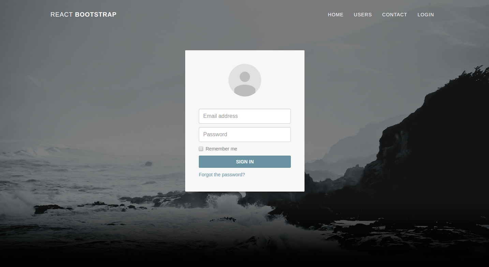

 

<strong>React.Js/Node.Js Project</strong>

 
## Quick start

1. FrontEnd part: `cd Frontend`
   Run `npm run setup` to install dependencies  
   Run `npm start` for development  
   Run `npm run build` for production  
   Run `npm run test` for testing       
1. BackEnd part: `cd Backend`
   Run `npm install` to install dependencies  
   Run `npm start` for development  
   Run `npm run prod` for production  
   Run `npm run test` for testing        

## Frontend

<dl>
  <dt> Authentication  </dt>
  <dd>Only User page needs authentication and `redux-auth-wrapper` high order component library is wrapped that page for authentication. Trying access to Users page without authentication, HOC will redirect to login page and login page validates token in sessionStorage if exist. If it not exist, client stays in login page. If re-login successful, re-direct again to desired page. </dd>
  <dd>Home, Login and Contact pages validate jwt token in mount state. </dd>
  <dd>Credentials are email:john@doe.com, password:secret  </dd>

  <dt>Styling</dt>
  <dd>Styles are in global-styles.js file which provide css injection to `head` tag </dd>

  <dt>Sagas </dt>
  <dd>For side effects, `redux-saga` is implemented. All the actions are sync and sagas listens stores and actions and catch the desired requests then fires back the request results  </dd>

  <dd> Main saga is in App container.This saga runs all the time, but other sagas destroy themselves after page change. <dd>

  <dt>Proxy </dt>
  <dd> All sagas uses '/api/*' paths for server. In development frontend node.js server rewrites all request to '/api/* -> /*' and backend server only handles '/*'.   </dd>
</dl>

## Backend

<dl>
  <dt> ES6  </dt>
  <dd> Babel compiler implemented for es6 features </dd>
  <dd> Any DB system not included, only endpoints </dd>
  <dd> /contact endpoint only logs datas, no saving or validation </dd>
</dl>

> Please note that there are only 2 React components and 3 endpoints have unit tests.
